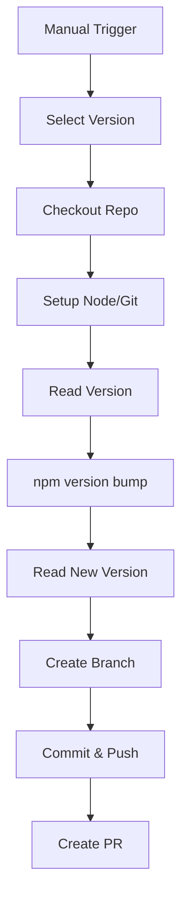

## Version Increment & PR Generation

`.github/workflows/bump.yml`

Automates version updates and pull request creation for package manifests.

```mermaid
graph TD
    A[Manual Trigger] --> B[Select Version]
    B --> C[Checkout Repo]
    C --> D[Setup Node/Git]
    D --> E[Read Version]
    E --> F[npm version bump]
    F --> G[Read New Version]
    G --> H[Create Branch]
    H --> I[Commit & Push]
    I --> J[Create PR]
```
