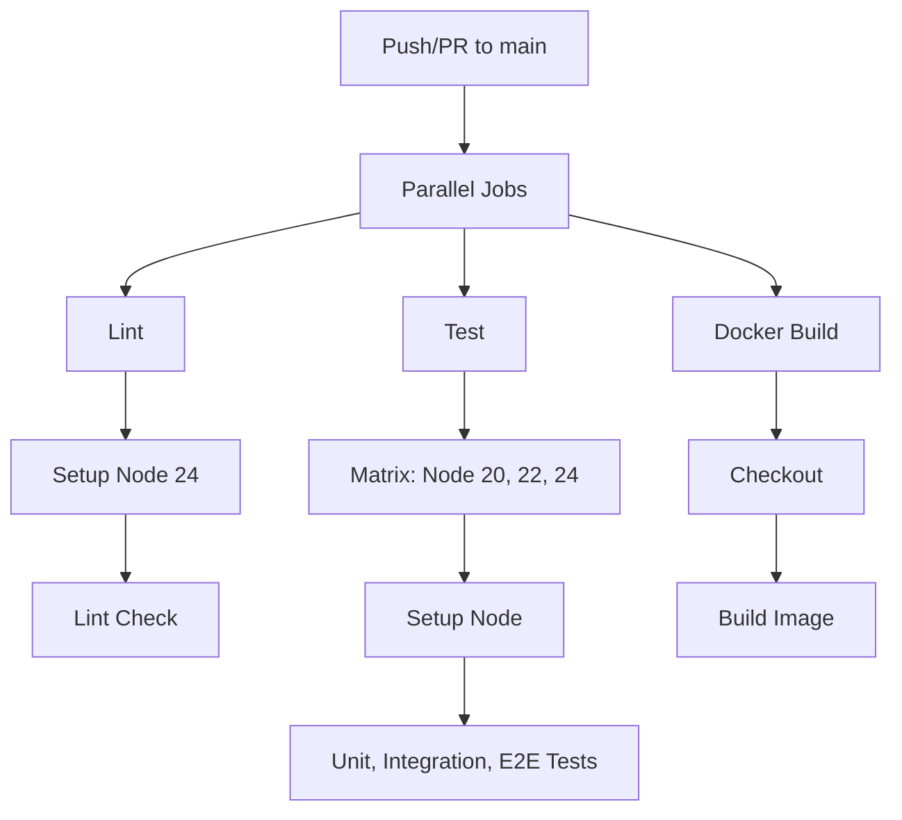

## Automated Testing & Build

`.github/workflows/ci.yml`

Executes automated linting, multi-version Node.js testing, and Docker image builds on push or pull request.

```mermaid
graph TD
    A[Push/PR to main] --> B[Parallel Jobs]
    B --> C[Lint]
    B --> D[Test]
    B --> E[Docker Build]
        C --> C1[Setup Node 24]
        C1 --> C2[Lint Check]

        D --> D1[Matrix: Node 20, 22, 24]
        D1 --> D2[Setup Node]
        D2 --> D3[Unit, Integration, E2E Tests]

        E --> E1[Checkout]
        E1 --> E2[Build Image]
```
