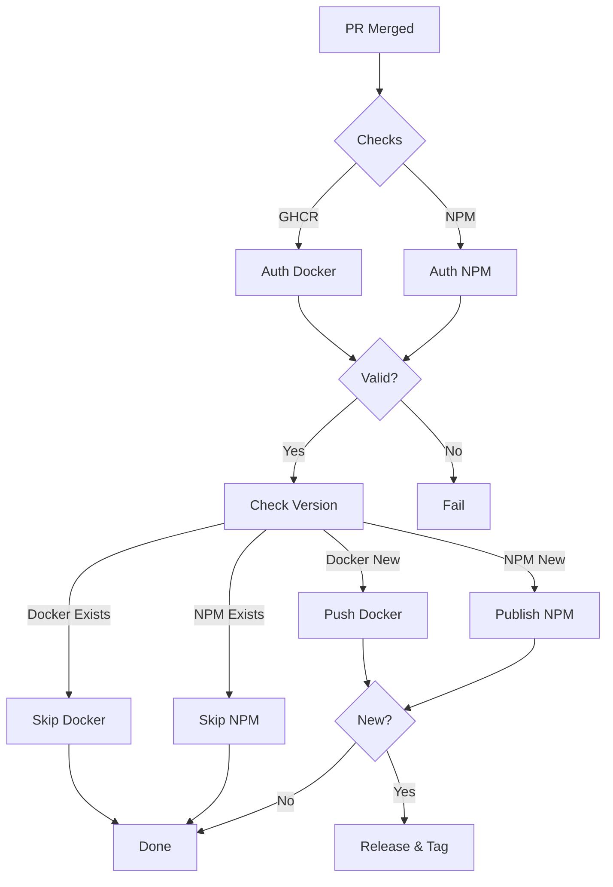

## Package Publication & Release

`.github/workflows/release.yml`

Manages NPM publishing, Docker image distribution to GHCR, and GitHub release tagging upon PR merge.

```mermaid
graph TD
    A[PR Merged] --> B{Checks}
    B -->|NPM| C[Auth NPM]
    B -->|GHCR| D[Auth Docker]
    C --> E{Valid?}
    D --> E
    E -->|Yes| F[Check Version]
    F -->|NPM Exists| G[Skip NPM]
    F -->|NPM New| H[Publish NPM]
    F -->|Docker Exists| I[Skip Docker]
    F -->|Docker New| J[Push Docker]
    H --> K{New?}
    J --> K
    K -->|Yes| L[Release & Tag]
    K -->|No| M[Done]
    G --> M
    I --> M
    E -->|No| N[Fail]
```
