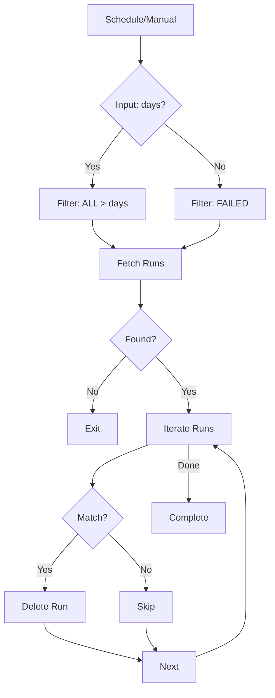

## Workflow History Cleanup

`.github/workflows/workflow-cleanup.yml`

Deletes historical workflow runs based on age or failure status to maintain repository hygiene.

```mermaid
graph TD
    A[Schedule/Manual] --> B{Input: days?}
    B -->|Yes| C[Filter: ALL > days]
    B -->|No| D[Filter: FAILED]
    C --> E[Fetch Runs]
    D --> E
    E --> F{Found?}
    F -->|No| G[Exit]
    F -->|Yes| H[Iterate Runs]
    H --> I{Match?}
    I -->|Yes| J[Delete Run]
    I -->|No| K[Skip]
    J --> L[Next]
    K --> L
    L --> H
    H -->|Done| M[Complete]
```
