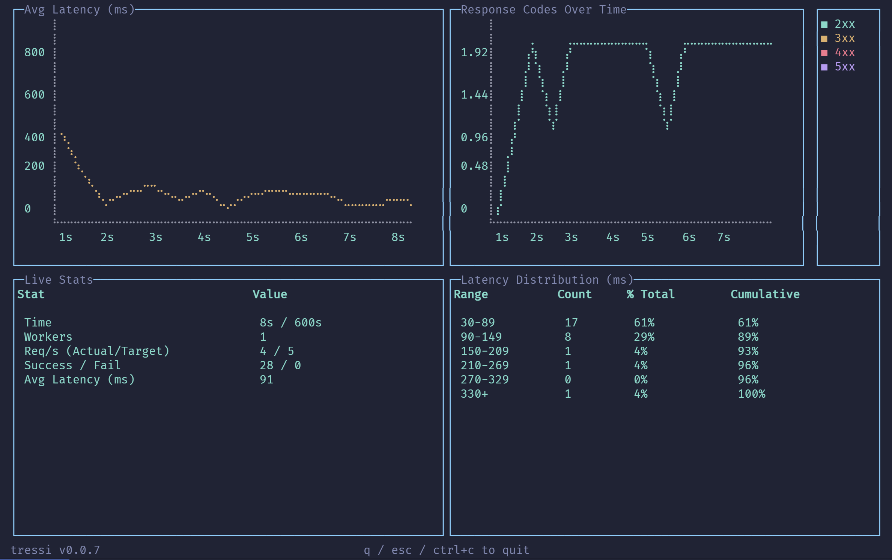

<p align="center">
  
  <br/>
  <em>Stress less, test more.</em>
  <br/><br/>
  <a href="./LICENSE">
    
  </a>
</p>

`tressi` is a **lightweight, declarative load testing tool** built for modern developers. Define your HTTP workflows in a simple JSON config file and unleash them with blazing concurrency, live terminal metrics, and full data exports. Use it as a CLI or embed it into your own tooling.

## 🚀 Features

- 📝 **Declarative JSON Config** — Define tests in a simple JSON file with full autocompletion and validation.
- ⚡️ **Autoscaling** - Automatically adjust the number of workers to meet a target Req/s.
- 👥 **Concurrent Workers** — Simulate realistic multi-user load with ease via workers.
- ⏱️ **Rate Limiting** — Control Req/s for accurate throttling scenarios.
- 📊 **Interactive Terminal UI** — View live Req/s, latency stats, and status codes.
- 📁 **Comprehensive Reporting** — Export results to Markdown, XLSX, and CSV for analysis.
- ⚙️ **Typed Configuration** - Uses Zod for robust configuration validation.

## 📦 Installation

You can install and use `tressi` in three different ways:

### 1. As a Package (for local development or programmatic use)

```bash
npm install tressi
```

### 2. As a CLI Tool (without installing)

Run directly using `npx`:

```bash
npx tressi init
```

### 3. Global Installation (for CLI use everywhere)

Install globally to run `tressi` from anywhere:

```bash
npm install -g tressi
```

## 🛠️ Usage

`tressi` can be run directly from the command line **or** used as a library in your own app.

### 🧪 CLI: Quick Start

1. **Generate a config file**

```bash
npx tressi init
```

2. **Run the test**

If you have a `tressi.config.json` file in your current directory, you can simply run:

```bash
npx tressi
```

Or, you can explicitly provide a path to a config file:

```bash
npx tressi --config ./path/to/your/tressi.config.json
```

### 📚 CLI Commands

| Command | Description                        |
| ------- | ---------------------------------- |
| `init`  | Create a `tressi.config.json` file |

### 🧪 Test Scenarios

`tressi` can be configured to simulate a variety of load testing scenarios. Here are a few examples:

#### Basic Load Test

A straightforward test with a fixed number of workers and a target Req/s. This command assumes a `tressi.config.json` file exists in the current directory.

```bash
npx tressi --workers 10 --duration 30 --rps 200
```

#### Ramp-up Load Test

Gradually increases the load to a target Req/s over a specified duration. This is useful for understanding how your system behaves as traffic increases.

```bash
npx tressi --config tressi.config.json --workers 20 --duration 60 --rps 500 --ramp-up-time 30
```

#### Spike Test

A short, intense burst of traffic to test your system's ability to handle sudden surges.

```bash
npx tressi --config tressi.config.json --workers 100 --duration 10
```

#### Soak Test (Endurance Test)

A long-running test to check for performance degradation, memory leaks, or other issues over an extended period.

```bash
npx tressi --config tressi.config.json --workers 5 --duration 300 --rps 50
```

#### Autoscaling Load Test

Dynamically adjusts the number of workers to meet a target Req/s, up to a specified maximum.

```bash
npx tressi --config tressi.config.json --autoscale --workers 50 --rps 1000 --duration 60
```

#### Headless & Export Test

Runs a test without the UI and exports the results to a specified directory.

```bash
npx tressi --config tressi.config.json --workers 20 --duration 30 --rps 300 --no-ui --export
```

### ⚙️ CLI Options

| Option               | Alias | Description                                                           | Default |
| -------------------- | ----- | --------------------------------------------------------------------- | ------- |
| `--config <path>`    | `-c`  | Path to the configuration file (e.g., `tressi.config.json`)           |         |
| `--workers <n>`      |       | Number of concurrent workers (for autoscale, this is the max workers) | `10`    |
| `--duration <s>`     |       | Total test duration in seconds                                        | `10`    |
| `--rps <n>`          |       | Target requests per second (ramps up to this value)                   |         |
| `--ramp-up-time <s>` |       | Time in seconds to ramp up to the target Req/s                        |         |
| `--autoscale`        |       | Enable autoscaling of workers (requires --rps)                        | `false` |
| `--export [path]`    |       | Export results to Markdown, XLSX, and CSVs                            | `false` |
| `--no-ui`            |       | Disable the interactive terminal UI (can improve performance)         | `false` |

### 🧬 Programmatic Usage

`tressi` can be used as a library to run load tests from your own Node.js scripts. The `runLoadTest` function accepts an `options` object and returns a `Promise` that resolves with a `TestSummary` object containing detailed results.

```ts
import { runLoadTest, TestSummary } from 'tressi';

async function myCustomScript() {
  console.log('Starting custom load test...');

  const summary: TestSummary = await runLoadTest({
    // Suppress all console output from tressi. Defaults to false.
    silent: true,
    // Define the test configuration directly
    config: {
      requests: [{ url: 'https://api.example.com/health', method: 'GET' }],
    },
    workers: 5,
    durationSec: 10,
    rps: 100, // Target 100 requests/second
  });

  console.log('Test complete. Analyzing results...');

  // Now you can use the summary object for custom logic
  if (summary.global.avgLatencyMs > 500) {
    console.error(
      `High latency detected: ${summary.global.avgLatencyMs.toFixed(0)}ms!`,
    );
    // You could trigger an alert or fail a CI/CD pipeline here
  }

  if (summary.global.failedRequests > 0) {
    console.error(`${summary.global.failedRequests} requests failed!`);
  }

  console.log('Custom script finished.');
}

myCustomScript();
```

## 📊 Live Terminal UI

When you run `tressi` (without the `--no-ui` flag), it displays a live dashboard with four key sections:

<p align="center">
  
</p>

### How to Interpret the Dashboard

1.  **Avg Latency (ms) (Top-Left)**
    - **What it is:** A line chart showing the average latency (in milliseconds) over a rolling time window. Each point on the graph represents the average latency of all requests that completed within that time slice.
    - **What to look for:** A steady, low line is ideal. Sudden spikes or a consistently rising trend can indicate performance bottlenecks under load.

2.  **Response Codes Over Time (Top-Right)**
    - **What it is:** A line chart that tracks the count of different response code categories (2xx, 3xx, 4xx, 5xx) over the course of the test. The x-axis shows the elapsed time in seconds.
    - **What to look for:** The appearance of red (4xx/5xx) lines, which signals that errors started occurring at a specific point in time during the test.

3.  **Live Stats (Bottom-Left)**
    - **What it is:** A table of key performance indicators (KPIs) for the entire test run so far.
    - **Key Stats:**
      - `Time`: Elapsed time versus the total test duration.
      - `Workers`: The current number of active concurrent workers.
      - `Req/s`: The actual requests per second versus your target.
      - `Success / Fail`: Total count of successful versus failed requests.
      - `Avg Latency`: The average latency across all requests.

4.  **Latency Distribution (Bottom-Right)**
    - **What it is:** A histogram that groups all completed requests into latency buckets (e.g., 17-42ms, 43-68ms).
    - **What to look for:** This shows you where the majority of your response times are concentrated. An ideal result is a tight grouping in the lowest buckets. A wide spread indicates inconsistent performance.

## ⚙️ Configuration Reference

The `tressi init` command will generate a `tressi.config.json` file with a `$schema` property. This property points to a JSON Schema file that provides autocompletion and validation in supported editors (like VS Code), making it easier to write valid configurations.

Your `tressi.config.json` file is a standard JSON file with the following root properties:

- `headers`: An object containing headers to be sent with each request.
- `requests`: An array of request objects, each with the following properties:
  - `url`: The URL to send the request to.
  - `method`: The HTTP method. It is case-insensitive, defaults to `GET`, and supports `GET`, `POST`, `PUT`, `PATCH`, `DELETE`, `HEAD`, and `OPTIONS`.
  - `payload`: (Optional) The data to send with the request.

## 📁 Exporting Results

The `--export` flag will generate a unique, timestamped directory containing a comprehensive set of data files:

- **📝 `report.md`**: A clean, readable Markdown summary of the test results.
- **📊 `report.xlsx`**: A multi-sheet Excel file with the global summary, per-endpoint summary, and raw request log.
- **📈 `results.csv`**: A raw log of all requests made during the test.

You can also provide a path to the `--export` flag to customize the base name of the output directory:

```bash
npx tressi --config tressi.config.json --workers 20 --duration 30 --rps 300 --no-ui --export my-test-results
```

This will create a uniquely named, timestamped directory, such as `my-test-results-2025-07-06T10:00:00.000Z`.
