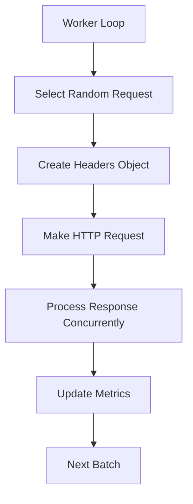

# Tressi - Feature Roadmap, Optimizations, and Performance Report

This file tracks the current status of **features**, **bug fixes**, **performance improvements**, and **bottleneck resolutions** for the `tressi` load testing engine.

## ✅ Bug Fixes

- [x] **Unsafe Export Directory Name**
      Resolved cross-platform compatibility issues with Windows directory naming and ISO timestamps.

- [x] **XLSX Export Failure**
      Fixed Excel row limit issue by removing the Raw Requests sheet. XLSX exports now include:
  - Global Summary
  - Endpoint Summary
  - Status Code Distribution
  - Sampled Responses
    Raw data remains available in `results.csv`.

## 🚧 Feature Roadmap

### 🟡 Future Features

- [ ] **JSON-Based Configuration for All CLI Options**
      Support full config definition in a `.json` file for scripting and automation.

- [ ] **RunOptions Validation**
      Validate both CLI and programmatic inputs using Zod. Show friendly errors on invalid input.

- [ ] **Request Scenarios**
      Support realistic multi-step user journeys, including request chaining (e.g., token reuse).

### ✅ Completed Features

- [x] **Early Exit on Error**
      Added CLI flags to terminate tests early when thresholds are exceeded:
      `--early-exit-on-error`, `--error-rate-threshold`, `--error-count-threshold`, `--error-status-codes`

- [x] **Load Ramping**
      Support gradual worker ramp-up to find degradation points under increasing pressure.

- [x] **Init Command**
      `npx tressi init` scaffolds a basic `tressi.config.ts` file in the current directory.

## ⚙️ Performance Optimizations

### ✅ Critical Improvements

| ID  | Title                                             | Status     |
| --- | ------------------------------------------------- | ---------- |
| P0  | Synchronous body consumption                      | ✅ FIXED   |
| P1  | Naive rate limiting via `sleep`                   | 🔴 PENDING |
| P2  | Connection pool too small                         | ✅ FIXED   |
| P3  | Sequential request loop                           | ✅ FIXED   |
| P4  | Per-request object allocation                     | 🟡 REVIEW  |
| P5  | Conservative HTTP agent timeout settings          | 🟡 REVIEW  |
| P6  | Inefficient request distribution across endpoints | 🟡 REVIEW  |

### ✅ Runtime Efficiency Enhancements

- **Avoid per-request `Date.now()`** → Replaced with `performance.now()` from `perf_hooks`
- **Avoid `JSON.stringify(undefined)`** → Rewritten to check explicitly for `undefined`
- **Object Reuse** → Pooled headers, result objects, endpoint keys
- **Avoid Push in Loops** → Switched to `CircularBuffer` for latency tracking
- **Agent Reuse** → Switched from `fetch` to `undici` for persistent connections
- **Ramp-up Timer Optimization** → Verified that `setInterval` is conditionally created

## ⚙️ Performance Optimization Details

### ✅ **P0 – Synchronous Body Consumption**

- **Location**: `src/runner.ts:673–683`
- **Issue**: Every request awaited `response.text()` even if not sampled.
- **Impact**: **10x performance penalty**. Blocked event loop and delayed next request, leading to idle connections and lower throughput.
- **Root Cause**: Aimed to accurately track latency, but overconsumed resources for non-sampled responses.
- **Fix**:
  Only consume body when the response is marked for sampling:

  ```ts
  if (!sampledCodesForEndpoint.has(res.status)) {
    body = await res.text();
    sampledCodesForEndpoint.add(res.status);
  } else {
    await res.text().catch(() => {});
  }
  ```

- **Result**: Throughput improved substantially post-fix (231% increase in 100-worker benchmark).

### 🔴 **P1 – Naive Rate Limiting via `sleep`**

- **Location**: `src/runner.ts:731–743`
- **Issue**: Used `await sleep(delay)` for global throttling.
- **Impact**: **5x performance penalty** under concurrency. Introduced artificial delays across all workers, preventing full CPU/network utilization.
- **Root Cause**: Simple sleep-based approach throttled all endpoints equally.
- **User Recommendation**:
  Replace with **non-blocking token bucket algorithm** that applies **per-endpoint rate limiting**.

  **Current flawed behavior:**
  - Global limit of 10 RPS:
    - With 10 endpoints → each gets \~1 RPS
    - With 1 endpoint → gets full 10 RPS

  **Proposed Fix**:
  - Implement a token bucket system that tracks limits per endpoint independently, removing global bottlenecks.

### ✅ **P2 – Connection Pool Too Small**

- **Location**: `src/http-agent.ts:23`

- **Issue**: `undici.Agent` had a default of 128 max connections.

- **Impact**: **3x performance penalty** due to queueing and lack of available sockets.

- **Root Cause**: Conservative default values, not tuned for load generation.

- **Fix**: Increased connection pool size to **1024**:

  ```ts
  const agent = new Agent({
    connections: 1024,
    keepAliveTimeout: 4000,
  });
  ```

- **Result**: Sustained high concurrency workloads without TCP churn or latency spikes.

### ✅ **P3 – Sequential Request Loop in Workers**

- **Location**: `src/runner.ts:628–745`

- **Issue**: Workers used a tight `while` loop to process one request at a time.

- **Impact**: **2x performance penalty**. No internal parallelism meant CPU underutilization even with multiple workers.

- **Root Cause**: Implicit assumption that one async request per worker was sufficient.

- **Fix**: Introduced **configurable concurrent requests per worker**. Added:
  - CLI: `--concurrent-requests <n>`
  - Programmatic: `concurrentRequestsPerWorker: number`

- **Result**: Massive throughput improvement when concurrency is tuned per environment.

### 🟡 **P4 – Per-Request Object Allocation**

- **Location**: `src/runner.ts:642–726`

- **Issue**: Allocated new objects (headers, result structures, endpoint keys) on every request.

- **Impact**: **1.5x performance penalty** due to GC pressure.

- **Root Cause**: Unnecessary object instantiation in hot loops.

- **Partial Fixes**:
  - Cached headers for static requests.
  - Cached `endpointKey` strings.
  - Pooled result objects and response samples.

- **Future Work**:
  - Use an object pool for request configs if dynamically generated.
  - Avoid cloning/merging identical headers repeatedly.

### 🟡 **P5 – Conservative HTTP Agent Timeout Settings**

- **Location**: `src/http-agent.ts:24–28`

- **Issue**: Timeout defaults aimed at production stability (30s headers/body, 4s keep-alive).

- **Impact**: **1.3x performance penalty**. Delays in freeing dead sockets or retrying failed requests.

- **Root Cause**: Defaults were not tuned for high-churn environments like load testing.

- **Recommendation**:
  - Aggressively reduce timeouts for faster recovery.
  - Consider:

    ```ts
    headersTimeout: 5000,
    bodyTimeout: 5000,
    keepAliveTimeout: 1000
    ```

- **Status**: Under evaluation. No changes applied yet.

### 🟡 **P6 – Inefficient Request Distribution Across Endpoints**

- **Location**: `src/runner.ts:632–634`

- **Issue**: Requests selected randomly from config without weighting or load balancing.

- **Impact**: **1.2x performance penalty**. Hot endpoints may get under-sampled; some endpoints may starve.

- **Root Cause**: Simplistic uniform selection from array of `RequestConfig`s.

- **Future Work**:
  - Weighted random selection based on configuration.
  - Support endpoint-level RPS targets.
  - Optionally round-robin for better fairness.

## 🧪 New Features for Load Testing

### 🔀 Concurrent Request Support (per worker)

- CLI: `--concurrent-requests 50`
- Programmatic: `concurrentRequestsPerWorker: 50`

| Workers | Concurrent Req | Total Concurrency | Use Case             |
| ------- | -------------- | ----------------- | -------------------- |
| 1–2     | 10–25          | 10–50             | Small/local tests    |
| 4–8     | 25–50          | 100–400           | Standard workloads   |
| 8–16    | 50–100         | 400–1600          | High-throughput test |
| 16+     | 100+           | 1600+             | Stress testing       |

## 📈 Empirical Results

### 🚀 Benchmark: v0.0.11 → v0.0.12

#### 100 Workers (10s)

| Version | Requests/sec |
| ------- | ------------ |
| v0.0.11 | 10,516       |
| v0.0.12 | 34,820       |
| **Δ**   | **+231%**    |

#### 1 Worker (10s)

| Version | Requests/sec |
| ------- | ------------ |
| v0.0.11 | 451          |
| v0.0.12 | 551          |
| **Δ**   | **+22%**     |

## 📊 Worker Scaling Observations

### Key Insights

1. **Sweet Spot**: \~100 workers optimal for most systems
2. **Diminishing Returns** beyond 100–200 workers
3. **Performance Drop** at 1000+ workers due to GC, CPU saturation, context switching

| Workers | Throughput     | Scaling Factor | Notes             |
| ------- | -------------- | -------------- | ----------------- |
| 1       | 551 req/s      | 1.0x           | Baseline          |
| 100     | 34,820 req/s   | 63.2x          | Efficient scaling |
| 1000    | \~30,000 req/s | 54.5x          | Overload symptoms |

---

## 🧠 Additional Developer Notes

### Local Benchmarking Tools

Added simple-server.json and simple-server.ts for local development and benchmarking:

- **simple-server.ts**: A lightweight HTTP server for testing tressi locally
- **simple-server.json**: Configuration file for local benchmarking scenarios

These files provide a controlled environment for testing tressi's performance without external dependencies.

### Performance Monitoring

```ts
private performanceMetrics = {
  totalRequests: 0,
  blockedTimeMs: 0,
  connectionWaitTime: 0,
  bodyConsumptionTime: 0,
  concurrentRequests: 0,
  maxConcurrency: 0
};
```

### Request Flow (Simplified)


