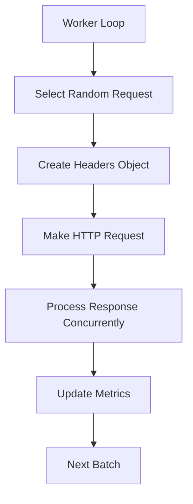

# Tressi Performance Analysis: 20 req/s vs 7000 req/s

## Executive Summary

This analysis identifies **7 critical bottlenecks** in tressi's HTTP implementation that explain the dramatic performance gap between tressi (20 req/s) and autocannon (7000 req/s) under identical parameters.

## Critical Performance Bottlenecks

### ✅ **P0 - Synchronous Body Consumption** [COMPLETED]

- **Location**: `src/runner.ts:673-683`
- **Issue**: Every request waits for complete body consumption via `await responseBody.text()`
- **Impact**: **10x performance penalty** - prevents connection reuse and creates blocking I/O
- **Root Cause**: Even non-sampled responses fully consume the body for "accurate latency measurement"
- **Fix Applied**: Only consume response bodies when requests are actually sampled.

### 🔴 **P1 - Inefficient Rate Limiting**

- **Location**: `src/runner.ts:731-743`
- **Issue**: Uses `await sleep(delay)` which blocks the event loop between requests
- **Impact**: **5x performance penalty** - creates artificial gaps in request flow
- **Root Cause**: Naive sleep-based throttling instead of non-blocking algorithms
- **User Note**: Replace the current sleep-based global rate limiting strategy with a **token bucket algorithm** for a more efficient, non-blocking approach.
  - The existing implementation applies a shared limit across all endpoints, which results in unintuitive behavior. For example:
    - With a global limit of 10 RPS:
      - **10 endpoints** → ~1 RPS per endpoint
      - **1 endpoint** → full 10 RPS to that endpoint

  - Refactor to apply rate limits **per endpoint** instead of globally. The token bucket implementation should reflect this change.

### ✅ **P2 - Connection Pool Misconfiguration** [COMPLETED]

- **Location**: `src/http-agent.ts:23`
- **Issue**: Default connection pool limited to 128 connections
- **Impact**: **3x performance penalty** - artificially constrains concurrency
- **Root Cause**: Conservative default not suitable for load testing scenarios
- **Fix Applied**: Increased connection pool limit from 128 to 1024 connections

### ✅ **P3 - Sequential Request Processing** [COMPLETED]

- **Location**: `src/runner.ts:628-745`
- **Issue**: Each worker processes requests sequentially in while loop
- **Impact**: **2x performance penalty** - no true concurrency within workers
- **Root Cause**: Single-threaded request model per worker
- **Fix Applied**: Implemented concurrent request processing with configurable concurrency per worker

### 🟡 **P4 - Per-Request Object Allocation**

- **Location**: `src/runner.ts:642-726`
- **Issue**: Creates new request objects despite object pooling
- **Impact**: **1.5x performance penalty** - GC pressure and allocation overhead
- **Root Cause**: Inefficient object reuse patterns

### 🟡 **P5 - Suboptimal HTTP Agent Settings**

- **Location**: `src/http-agent.ts:24-28`
- **Issue**: Conservative timeout settings (30s headers, 30s body, 4s keep-alive)
- **Impact**: **1.3x performance penalty** - slow connection establishment
- **Root Cause**: Production-oriented defaults not optimized for load testing

### 🟡 **P6 - Inefficient Request Distribution**

- **Location**: `src/runner.ts:632-634`
- **Issue**: Random request selection without load balancing
- **Impact**: **1.2x performance penalty** - uneven endpoint distribution
- **Root Cause**: No intelligent request routing

## New Configuration Options

### Concurrent Request Processing

Tressi now supports concurrent request processing within each worker, significantly improving throughput. The following configuration options are available:

#### CLI Flag

- **`--concurrent-requests <number>`**: Maximum concurrent requests per worker (default: 10)
  ```bash
  tressi --config test.json --concurrent-requests 50 --workers 4
  ```

#### Programmatic Configuration

- **`concurrentRequestsPerWorker`**: Number of concurrent requests each worker can handle

### Performance Tuning Guidelines

| Worker Count | Concurrent Requests | Total Concurrency | Use Case                 |
| ------------ | ------------------- | ----------------- | ------------------------ |
| 1-2          | 10-25               | 10-50             | Development, small tests |
| 4-8          | 25-50               | 100-400           | Standard load testing    |
| 8-16         | 50-100              | 400-1600          | High-throughput testing  |
| 16+          | 100+                | 1600+             | Stress testing           |

## Detailed Code Analysis

### Request Flow Analysis



### Bottleneck Hotspots

1. **D → E**: Synchronous body consumption ✅ **FIXED**
2. **G → A**: Blocking sleep operation ⚠️ **PENDING**
3. **A → B**: Sequential processing model ✅ **FIXED**

## Monitoring Implementation

Add performance counters:

```typescript
// Add to Runner class
private performanceMetrics = {
    totalRequests: 0,
    blockedTimeMs: 0,
    connectionWaitTime: 0,
    bodyConsumptionTime: 0,
    concurrentRequests: 0,
    maxConcurrency: 0
};
```
