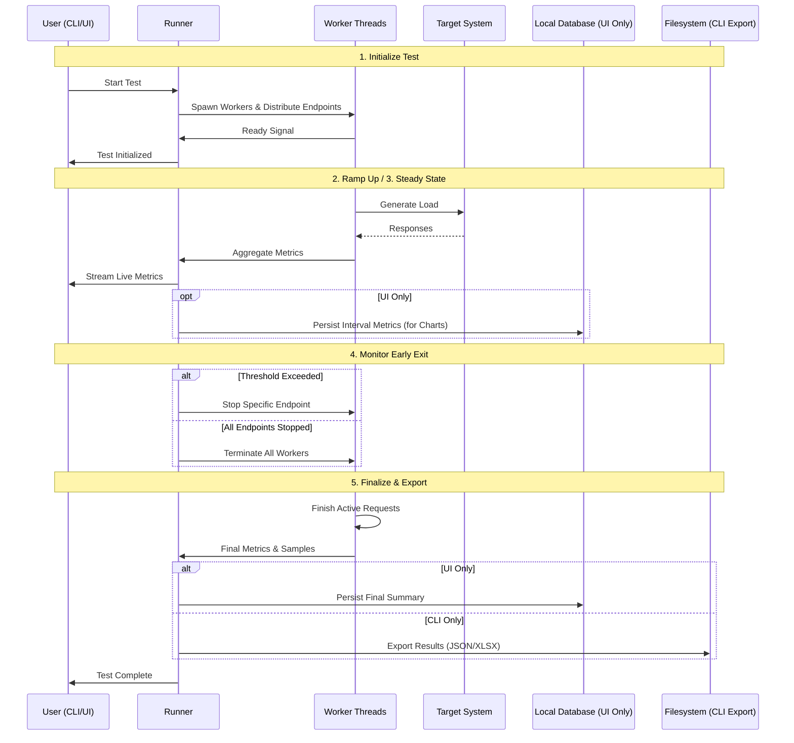

# Lifecycle Management

Tressi executes tests through a structured lifecycle designed to ensure stable load generation and accurate performance data. This process manages the transition from initial resource allocation to final data persistence, providing a consistent environment for both short bursts and long duration soak tests.

This document covers:

- **Initialization & Load Progression**: Resource allocation and managing the transition from ramp up to steady state.
- **Early Exit Monitoring**: Selective termination of endpoints based on error thresholds.
- **Finalization & Export**: Graceful shutdown and data consolidation for final reporting.

### Tressi Lifecycle

The following diagram illustrates the interaction between the runner, worker threads, and the target system during a standard execution run:

### 1. Initialize Test

Tressi prepares the execution environment to ensure predictable load generation:

- **Resource Allocation**: Spawns worker threads based on configuration.
- **Endpoint Distribution**: Maps target URLs to specific workers for balanced load.
- **Communication Layer**: Establishes the internal bus for metrics aggregation.

### 2. Ramp Up

- **Load Progression**: Increases request rate linearly from zero to the target RPS.
- **Traffic Stabilization**: Prevents system shock and allows target environments to scale, ensuring metrics reflect sustained performance rather than cold start spikes.

### 3. Steady State

- **Constant Load**: Maintains the target request rate for the test duration.
- **Asynchronous Execution**: Workers generate parallel requests to maximize throughput.
- **Live Monitoring**: Aggregates performance data for immediate visibility into system behavior.

### 4. Monitor Early Exit

- **Threshold Evaluation**: Stops individual endpoints if they exceed Error Rate Thresholds or return blacklisted status codes.
- **Selective Termination**: Allows healthy endpoints to continue testing while protecting failing systems from further load.
- **Test Termination**: The entire test run terminates if all endpoints have been stopped or all worker threads reach a terminal state.

### 5. Finalize & Export

- **Graceful Shutdown**: Workers complete active requests before terminating.
- **Data Consolidation**: Merges latency distribution data and response samples into a final summary.
- **Persistence**: Saves results to the local database or exports to the filesystem.

### Next Steps

Review [Interpreting Results](./04-interpreting-results.md) to learn how to analyze your test metrics.
