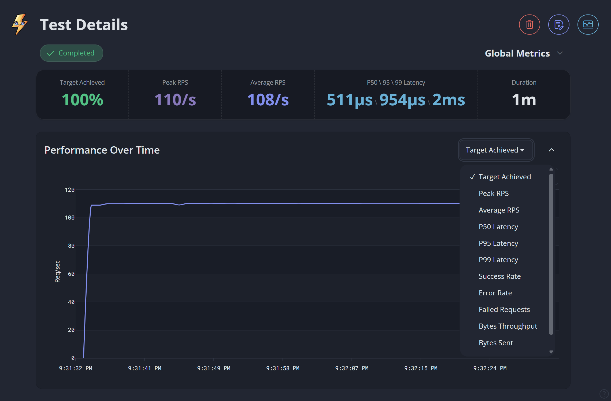
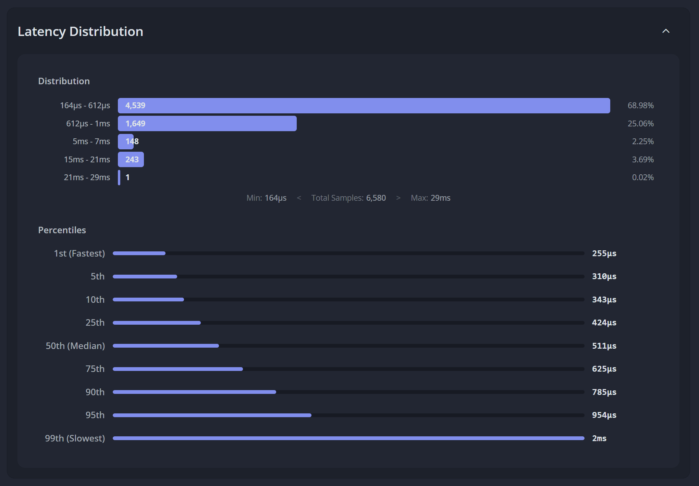
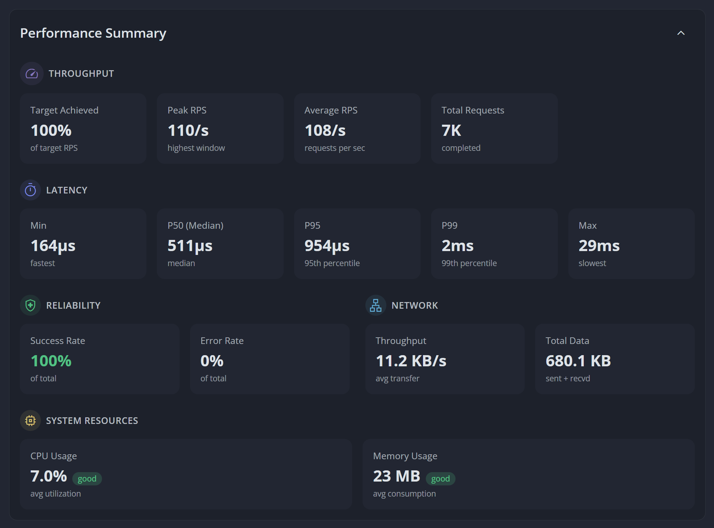

# Analyzing Results

Analyze test performance using global and per endpoint metrics, visualizations, and system resource utilization data.

This document covers:

- **Throughput & Latency**: Understanding performance scopes and key metrics like RPS and percentiles.
- **Reliability & Resources**: Monitoring success rates and runner resource utilization to ensure test integrity.
- **Visualization & Analysis**: Using charts and response samples to identify performance patterns and debug failures.

### Understand Scopes

Performance data is available at two levels:

- **Global Metrics**: Aggregated data across all endpoints defined in the test configuration. Includes system resource utilization and total network throughput.
- **Endpoint Metrics**: Specific performance data for individual targets. Includes status code distributions and response samples.

### Visualize Performance

Use charts to identify patterns, degradation, and outliers that aggregate metrics may obscure.

**Performance Over Time**: A timeseries chart tracking throughput, latency, and error rates. Use this to identify performance degradation or instability throughout the test duration.

**Latency Distribution**: Displays response time spread across buckets and percentiles. Use this to identify tail latency patterns and multi-modal distributions (e.g., requests hitting a cache vs. a database).

- **Distribution**: Displays how requests are spread across latency buckets. This view highlights concentrations and groupings of response times.
- **Percentiles**: Illustrates time relativity and scale across the response spectrum, providing a visual representation of the performance spread.

**Performance Summary**: Review aggregate performance telemetry and system resource utilization.

### Monitor Throughput

Throughput measures request volume processed by the target system.

- **Target Achieved**: The percentage of the configured target that was successfully executed. Values below 100% indicate the runner or target system could not maintain the requested load.
- **Peak RPS**: The highest throughput achieved within a measurement window.
- **Average RPS**: The mean number of requests per second completed throughout the test duration.
- **Max Throughput**: The theoretical upper limit of the target system based on median latency. Use this to evaluate scaling efficiency under concurrent load.
- **Total Requests**: The absolute count of completed requests.

### Measure Latency

Latency represents the round trip time for requests, measured in milliseconds (ms).

- **Min / Max**: The fastest and slowest individual response times recorded.
- **P50 (Median)**: 50% of requests were faster than this value. Represents the median response time.
- **P95**: 95% of requests were faster than this value. A standard benchmark for identifying performance degradation.
- **P99**: 99% of requests were faster than this value. Use this to identify tail latency issues that affect the slowest 1% of requests.

> **Note**: Tressi uses median (P50) over mean (average) because it resists outlier skew, which can significantly distort metrics.

### Assess Reliability

Monitor stability and data transfer efficiency during test execution.

- **Success Rate**: The ratio of successful (2xx) responses to total requests.
- **Error Rate**: The percentage of requests that resulted in non 2xx status codes or network level failures.
- **Network Throughput**: The average rate of data transfer (bytes/sec) during the test.
- **Total Data**: The sum of all bytes sent in request bodies and received in response bodies.

### Analyze Responses

**Status Code Distribution**: A breakdown of all HTTP status codes returned by the target system. Use this to diagnose the root cause of high error rates.

**Response Samples**: Tressi captures representative response data, including headers and bodies, to assist in debugging validation failures.

### Monitor Runner Resources

Monitor runner resource usage to ensure test integrity. Tressi's multithreaded architecture isolates request execution from metrics aggregation, but system wide exhaustion still impacts results.

- **CPU Usage**: If system CPU utilization exceeds **85%**, the runner may fail to maintain target RPS across all worker threads, leading to a "Target Achieved" value below 100%.
- **Worker Memory**: Each worker thread has an isolated heap (default 128MB). If a worker approaches its limit, it may experience frequent garbage collection pauses that inflate latency measurements for its assigned endpoints.
- **Main Thread Memory**: The global memory metric tracks the main thread. High utilization here can cause UI/CLI lag or delays in metrics aggregation, but typically does not impact request execution timing.

### Explore Advanced Operations

Review [Advanced Operations](../03-advanced/index.md) to explore production grade testing and optimization strategies.
