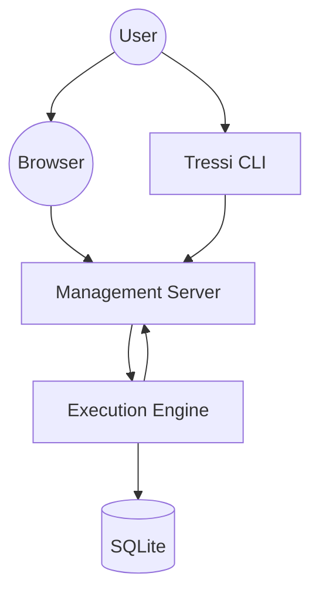
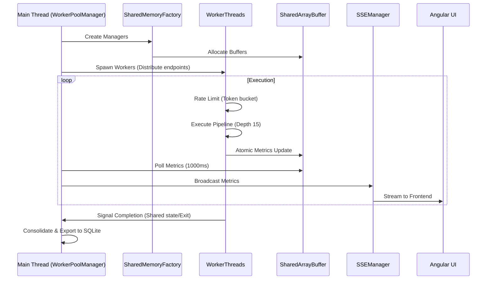

# Architecture Overview

Tressi utilizes a multithreaded architecture optimized for high concurrency load generation and realtime metrics aggregation. The platform leverages Node.js `worker_threads` for parallel execution and `SharedArrayBuffer` for zero copy metrics synchronization.

This document covers the relationship between system components, the execution pipeline, and the implementation of low overhead data collection.

### Application Architecture

Tressi is packaged as a unified CLI that encapsulates both the execution engine and the management interface.

### System Components

- **Orchestrating the CLI**: The primary entry point responsible for lifecycle management. The CLI validates user provided test parameters using the `TressiConfig` schema and coordinates the transition between test execution and the API server.
- **Serving the UI**: Provides a type safe RPC interface via Hono and manages realtime streaming of metrics to the Angular UI. The server utilizes `SSEManager` to broadcast internal execution events via Server Sent Events (SSE).
- **Data Persistence**: Manages the SQLite lifecycle via Kysely, ensuring persistence of test configurations and historical timeseries metrics for trend visualization in the dashboard.

### Execution Engine

- **Parallel Execution**: Spawns independent `worker_threads` to maximize CPU utilization. The `SharedMemoryFactory` implements round robin distribution of endpoints to ensure balance across workers.
- **Asynchronous Pipelines**: Each worker maintains an asynchronous pipeline with a depth of 15 concurrent requests to maximize throughput while keeping the event loop responsive.
- **Traffic Smoothing & Rate Limiting**: Utilizes a token bucket algorithm with linear ramp up logic and staggered execution to prevent thundering herd effects and ensure smooth traffic patterns.

### Metrics & Observability

- **Shared Memory Layer**: A zero copy communication layer built on `SharedArrayBuffer` and `Atomics`. This layer tracks lifecycle states for workers and provides high performance atomic counters for success counts, status codes, and network throughput.
- **Latency Tracking**: Records high resolution latency data using HDR histograms with configurable precision, enabling microsecond level analysis.
- **Realtime Aggregation**: The `MetricsAggregator` polls shared memory every 1000ms. The aggregator approximates global latency percentiles using weighted averages of per worker histograms and calculates peak RPS using a sliding window.

### Lifecycle Management

### Next Steps

Explore the [Shared Memory Architecture](./02-shared-memory.md) to understand how Tressi implements zero copy metrics synchronization using `SharedArrayBuffer` and `Atomics`.
