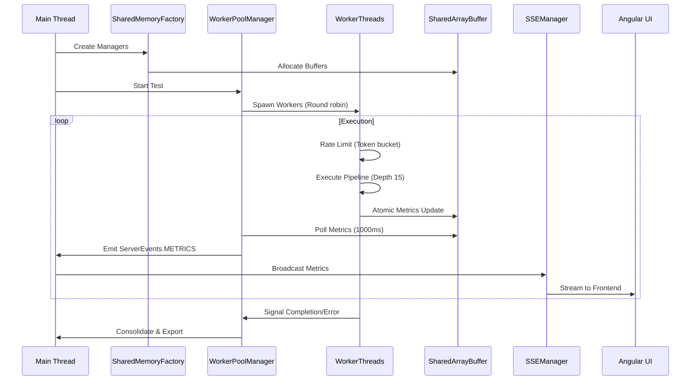

# Architecture Overview

Tressi utilizes a multithreaded architecture optimized for high concurrency load generation and realtime metrics aggregation. It leverages Node.js `worker_threads` for parallel execution and `SharedArrayBuffer` for zero copy metrics synchronization.

### Orchestrating the CLI

The primary entry point responsible for lifecycle management and coordination.

- **Configuration Validation**: Uses the `TressiConfig` schema to validate user provided test parameters before execution.
- **Database Management**: Manages the SQLite lifecycle via `tressi-cli/src/database/db.ts`, ensuring persistence of test configurations and historical metrics.
- **Process Coordination**: Orchestrates the transition between test execution and the API server, managing the initialization of shared memory structures.

### Serving the UI

Provides a type safe RPC interface for test management and serves the Angular UI.

- **Type Safe Communication**: Leverages Hono RPC to provide end to end type safety between the CLI server and the Angular UI.
- **Event Driven Updates**: Listens to the global event emitter to bridge internal execution events to the UI via Server Sent Events (SSE).
- **Realtime Streaming**: Utilizes `SSEManager` to broadcast `ServerEvents.METRICS` to connected clients.

### Managing Worker Threads

The execution engine responsible for generating load.

- **Parallel Execution**: Spawns independent `worker_threads` to maximize CPU utilization.
- **Endpoint Distribution**: Implements round robin distribution of endpoints in `SharedMemoryFactory` to ensure balance across workers.

### Synchronizing Shared Memory

Tressi uses a zero copy communication layer built on `SharedArrayBuffer` for low overhead metrics collection.

- **State Management**: Tracks lifecycle states for workers and per endpoint execution status to enable coordinated early exit logic.
- **Atomic Counters**: Provides high performance counters for success counts, status codes, and network throughput.
- **Latency Tracking**: Records high resolution latency data using HDR histograms with configurable precision.
- **Learn More**: See the [Shared Memory Architecture](./02-shared-memory.md) for implementation details.

### Executing Asynchronous Pipelines

Tressi implements an asynchronous pipeline designed for high throughput request generation.

- **Pipeline Architecture**: Each worker maintains an asynchronous pipeline with a depth of 15 concurrent requests to maximize throughput while keeping the event loop responsive.
- **Traffic Smoothing**: Implements staggered execution to prevent thundering herd effects and ensure smooth traffic patterns.
- **Rate Limiting**: Utilizes a token bucket algorithm with linear ramp up logic to enforce target limits.
- **Learn More**: See the [Execution Engine](./03-execution-engine.md) for pipeline and rate limiting details.

### Aggregating Metrics

The aggregation layer consolidates data from shared memory for realtime monitoring and reporting.

- **Polling Strategy**: The `MetricsAggregator` polls shared memory managers every 1000ms to collect the latest counters and histograms.
- **Weighted Aggregation**: Approximates global latency percentiles using weighted averages of per worker HDR histograms.
- **Sliding Window RPS**: Calculates peak RPS using a 5 second sliding window to provide an accurate representation of sustained throughput.
- **Learn More**: See [Metrics and Calculations](./04-metrics-and-calculations.md) for statistical analysis details.

### Data Persistence

Tressi uses SQLite for persistent storage of test data and metrics.

- **Schema Management**: The database schema is managed by Kysely.
- **Timeseries Data**: Stores timeseries metrics for both global and per endpoint data, enabling historical analysis and trend visualization in the dashboard.

### Lifecycle Management

### Next Steps

Explore the [Shared Memory Architecture](./02-shared-memory.md) to understand how Tressi implements zero copy metrics synchronization using `SharedArrayBuffer` and `Atomics`.
