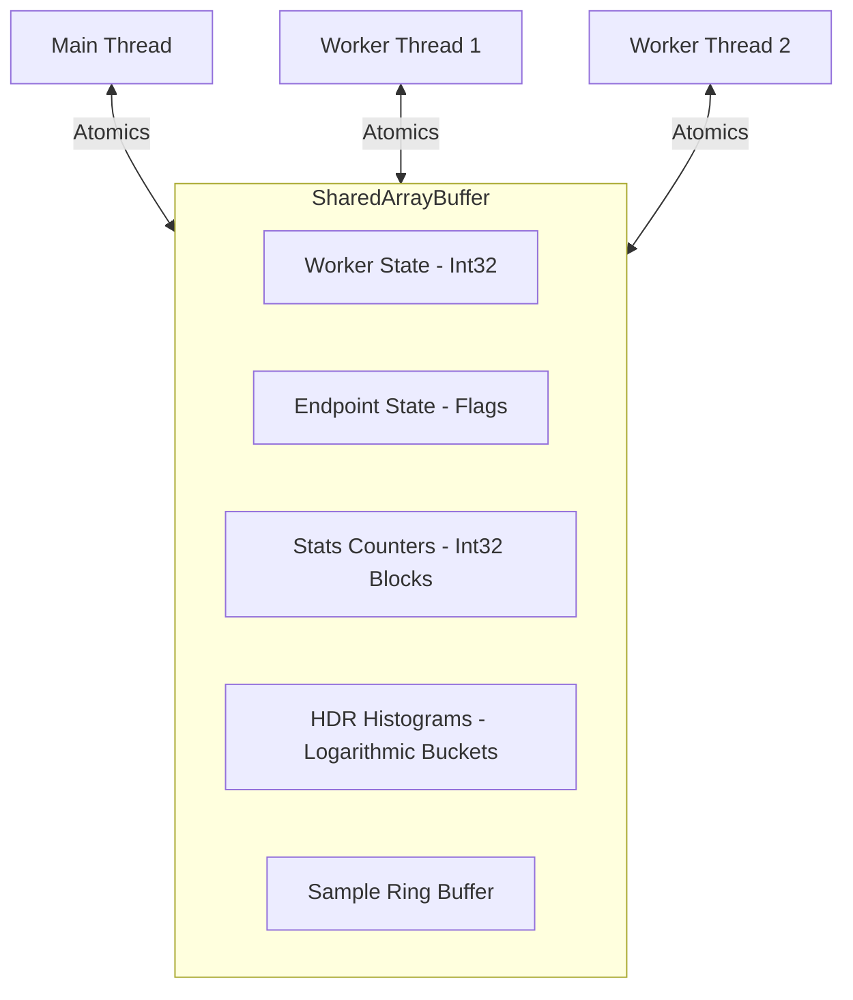

# Shared Memory Architecture

Tressi utilizes `SharedArrayBuffer` and `Atomics` to implement a zero copy metrics collection system. By operating on a single block of shared memory, Tressi eliminates the serialization and copying overhead associated with Node.js interprocess communication, enabling high frequency updates without impacting the event loop.

This document covers the memory segmentation strategy, the use of atomic operations for thread safe synchronization, and the layout of counters and histograms within the shared buffer.

### Partitioning Shared Buffers

- **Worker State**: Tracks thread lifecycle (Initializing, Ready, Running, Finished, Error) using 4 byte `Int32` slots per worker.
- **Endpoint State**: Provides a control plane for the main thread to signal early exits to specific workers via per endpoint state flags.
- **Stats Counters**: Stores frequency request metrics including success/failure counts, network throughput, and status code distributions.
- **HDR Histograms**: Maintains latency distribution data with microsecond precision using a canonical HDR histogram implementation.

### Defining Memory Layout

The `SharedMemoryFactory` manages the allocation and partitioning of `SharedArrayBuffer` instances. It ensures that each worker has dedicated memory regions for its assigned endpoints to minimize cache contention.

#### Allocating Counter Blocks

Each endpoint is allocated a fixed size counter block:

| Offset | Field                | Type       | Description                            |
| ------ | -------------------- | ---------- | -------------------------------------- |
| 0      | Success Count        | Int32      | Total successful requests              |
| 1      | Failure Count        | Int32      | Total failed requests                  |
| 2      | Bytes Sent           | Int32      | Cumulative network egress              |
| 3      | Bytes Received       | Int32      | Cumulative network ingress             |
| 8      | Sampled Status Codes | Int32[600] | Recent status codes for sampling       |
| 608    | Status Counters      | Int32[600] | Frequency of status codes (100-699)    |
| 1208   | Body Sample Indices  | Int32[N]   | Ring buffer for response body sampling |

#### Implementing HDR Histograms

Tressi implements a canonical HDR histogram mapping to provide microsecond precision latency tracking with constant memory overhead:

- **Microsecond Precision**: Latencies are recorded in microseconds to capture sub millisecond jitter.
- **Dynamic Range**: Supports values from 1μs up to 120s while maintaining configurable significant figures (default: 3).
- **Bucket Mapping**: Uses a logarithmic bucket and sub bucket indexing scheme to provide consistent relative accuracy across the entire range.

### Synchronizing Thread Access

To ensure data integrity without the use of mutexes or locks, Tressi employs the `Atomics` API for thread safe memory access:

- **`Atomics.add()`**: Increments request counters and latency buckets from worker threads without blocking.
- **`Atomics.load()`**: Retrieves realtime metrics for UI updates and reporting.
- **`Atomics.store()`**: Updates worker and endpoint states.
- **`Atomics.wait()` / `Atomics.notify()`**: Synchronizes worker thread startup and shutdown sequences, allowing the main thread to wait for all workers to reach a `READY` state before beginning execution.

### Validating Memory Allocation

The `SharedMemoryFactory` precalculates exact byte requirements before test execution based on the number of workers, endpoints, and configured buffer sizes.

- **Validation**: Requirements are validated against the 2GB `SharedArrayBuffer` limit.
- **Preallocation**: All memory is allocated upfront to prevent runtime allocation failures or garbage collection pauses during high load execution.
- **Alignment**: Memory offsets are calculated to ensure proper 4 byte alignment for `Int32Array` and `Uint32Array` views.

### Next Steps

Explore the [Execution Engine](./03-execution-engine.md) to understand how Tressi coordinates high concurrency HTTP load generation using an asynchronous pipeline architecture.
