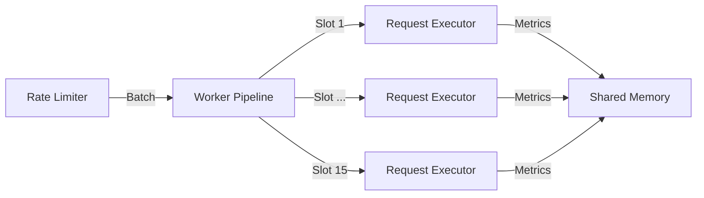
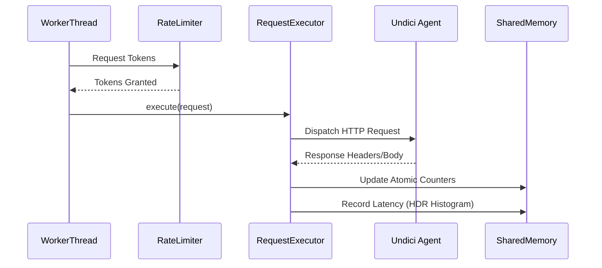

# Execution Engine

The Tressi execution engine utilizes an asynchronous pipeline architecture optimized for concurrent HTTP load generation. By leveraging Node.js `worker_threads` and the `undici` HTTP client, the engine achieves high throughput with minimal CPU and memory overhead.

This document details the internal mechanics of the execution pipeline, including throughput control, rate limiting algorithms, and the lifecycle of an individual request.

### Execution Pipeline

The engine operates on a pull based batching model where workers retrieve tasks from a rate limiter and execute them across a concurrent pipeline.

### Managing Asynchronous Pipelines

Tressi workers maintain a concurrent pipeline to maximize network utilization without blocking on individual request response cycles.

- **Concurrent execution**: Each worker maintains a `Set` of active `Promises` with a default pipeline depth of 15.
- **Event loop management**: The engine uses `setImmediate` to yield control between batches, preventing event loop starvation during high throughput scenarios.
- **Traffic smoothing**: A 2ms stagger is applied between requests within a batch to prevent synchronized load effects on target infrastructure.
- **Batch processing**: Workers retrieve batches of available tokens from the `WorkerRateLimiter` and execute them asynchronously, maintaining the pipeline depth as requests complete.

### Throughput Control

#### Endpoint distribution

The engine distributes target endpoints across available `worker_threads` using a round robin algorithm. This ensures load generation is balanced across CPU cores and prevents any single worker from becoming a bottleneck.

#### Rate limiting

Throughput is controlled via a Token Bucket algorithm implemented in the `WorkerRateLimiter`.

- **Token replenishment**: Tokens are generated based on the target RPS (Requests Per Second) and elapsed time.
- **Burst capacity**: The bucket allows for bursts up to 2x the target RPS to handle transient network fluctuations while maintaining the long term target rate.
- **Linear ramp up**: The engine supports configurable ramp up periods, linearly increasing the token generation rate from zero to the target RPS.
- **Endpoint specific limiting**: Rate limits are calculated and enforced independently for each endpoint configuration.

### Request Execution

The `RequestExecutor` manages the internal HTTP lifecycle using the `undici` client for optimized networking. The `AgentManager` coordinates connection pools per origin to optimize resource reuse.

- **Connection pooling**: The `AgentManager` maintains endpoint specific agents with a default limit of 256 connections per origin, a 10,000ms keep-alive timeout, and 30,000ms timeouts for headers and bodies.
- **Object pooling**: To minimize garbage collection overhead, the engine reuses header objects and result structures from a preallocated pool.
- **High resolution timing**: Latency is measured using `performance.now()` for microsecond precision.
- **Bandwidth tracking**: The engine calculates `bytesSent` (request body) and `bytesReceived` (response body or `Content-Length` header) for network throughput metrics.
- **Response sampling**: Response bodies are sampled based on status codes to provide debugging context without excessive memory consumption.

### Next Steps

Explore [Metrics and Calculations](./04-metrics-and-calculations.md) to understand how raw execution data is transformed into performance insights using HDR histograms and sliding window aggregation.
