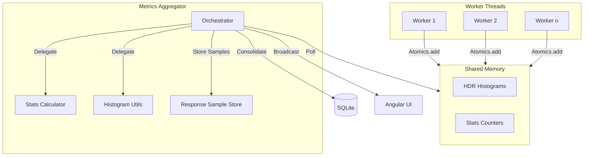

# Metrics and Calculations

Tressi utilizes a high performance metrics aggregation system built on `SharedArrayBuffer` and `Atomics`. By decoupling data collection from reporting, the platform maintains microsecond precision latency tracking and stable throughput calculations without impacting the execution of the load generation pipeline.

This document details the mathematical models and aggregation strategies used to transform raw execution events into actionable performance insights.

### Metrics Aggregation Flow

The `MetricsAggregator` polls shared memory at 1000ms intervals to consolidate data from all worker threads into a global state.

### Modular Architecture

To maintain maintainability and testability, the metrics aggregation logic is split into several specialized modules:

- **`MetricsAggregator`**: The main orchestrator responsible for the polling lifecycle, worker data retrieval, and event emission.
- **`StatsCalculator`**: A stateless module containing pure functions for calculating weighted latency averages and percentiles across multiple histograms.
- **`ResponseSampleStore`**: Manages the collection and deduplication of HTTP response body samples during test execution.
- **`HistogramUtils`**: Handles the conversion of raw worker histograms into the logarithmic bucket format used for visualization.

### Calculating Latency

Tressi implements High Dynamic Range (HDR) Histograms to track latency across a wide range of values with constant relative accuracy.

- **Microsecond precision**: Recording latency in microseconds enables accurate calculation of latency percentiles.
- **Atomic recording**: Worker threads use `Atomics.add` to increment histogram buckets in `SharedArrayBuffer`, ensuring $O(1)$ recording time.
- **Weighted aggregation**: Calculating global statistics via weighted averages of histogram means and percentiles preserves accuracy across varying request volumes. This is handled by the `StatsCalculator`.
- **Logarithmic visualization**: Merging histogram data into 10 logarithmic buckets provides resolution for the majority of requests while capturing the long tail. This is handled by `HistogramUtils`.

### Calculating Throughput

#### Calculating Peak RPS

Tressi calculates Peak Requests Per Second (RPS) as the highest instantaneous RPS observed during steady-state operation.

- **Instantaneous RPS**: Each measurement captures the delta in total requests between polling intervals, divided by the time elapsed.
- **Per-snapshot peak**: Each snapshot's `peakRequestsPerSecond` reflects the instantaneous RPS for that measurement interval only (no accumulation over time).
- **Final peak**: The `transformAggregatedMetricsToTestSummary` function derives the final peak by taking the maximum instantaneous RPS across all steady-state snapshots, representing the highest throughput achieved at any point during steady-state.
- **Steady-State Snapshots**: Peak RPS is determined using only "steady-state" snapshots (snapshots taken after the ramp-up period has concluded). If no steady-state data exists (e.g., early exit during ramp-up), it falls back to all snapshots.

#### Measuring Target Achievement

The **Target Achieved** metric quantifies the ratio of delivered throughput to requested load.

- **Steady-State Average**: Target Achieved is calculated using the **steady-state average RPS** instead of Peak RPS. This ensures the metric reflects sustained performance rather than momentary peaks.
- **Endpoint calculation**: Calculated as `Steady-State Average RPS / Configured RPS` for each endpoint.
- **Global aggregation**: The global target achievement is the arithmetic mean of all endpoint achievement percentages.
- **Saturation & Failure Analysis**: Values below 100% indicate that the test has reached a performance ceiling, typically pointing to target system saturation, network bandwidth limits, or runner resource exhaustion (CPU/Memory).

#### Estimating Theoretical Capacity

Tressi estimates maximum throughput based on observed latency.

- **Theoretical Max RPS**: Calculated as `1000 / P50 Latency (ms)`. This represents the maximum throughput a single serial execution thread could achieve for a given endpoint.

### Calculating Network Throughput

Tressi monitors network utilization by intercepting request and response streams.

- **Payload tracking**: Aggregates the size of all outgoing request payloads and incoming response bodies.
- **Throughput rate**:
  - **Global Average RPS**: Calculated as `Total Requests / Total Test Duration`. This represents overall throughput across the entire test run.
  - **Endpoint Average RPS**: Calculated using a "steady-state window" denominator (`Total Duration - Effective Ramp-Up`) to represent sustained throughput.
- **Resource Metrics (CPU/Memory)**: Averages for `avgSystemCpuUsagePercent` and `avgProcessMemoryUsageMB` are derived from steady-state snapshots to avoid dilution by the ramp-up phase.
- **Network Throughput Rate**: Calculated as `(Total Bytes Sent + Total Bytes Received) / Test Duration`, expressed in bytes per second.

### Aggregating Status Codes

Atomic counters track the distribution of HTTP response codes to identify error patterns.

- **Full range tracking**: Dedicated counters for all status codes from 100 to 699.
- **Status code bitmap**: A 600 bit bitmap per endpoint ensures that only the first instance of a unique status code triggers a full response body sample, minimizing memory and I/O overhead.
- **Error rate**: Calculated as `Failed Requests / Total Requests`, where failures are defined by the execution engine validation logic.

### Sampling System Resources

System level metrics provide context for performance results and identify local bottlenecks.

- **CPU utilization**: Calculated based on system load average relative to available CPU cores.
- **Memory footprint**: Tracks the heap usage of the Tressi process throughout the test execution.
- **Sampling interval**: Resource metrics are sampled every 2 seconds to minimize monitoring overhead.

### Next Steps

Explore the [Schema Migration Architecture](./05-schema-migrations.md) to learn how Tressi handles JSON configuration versioning.
