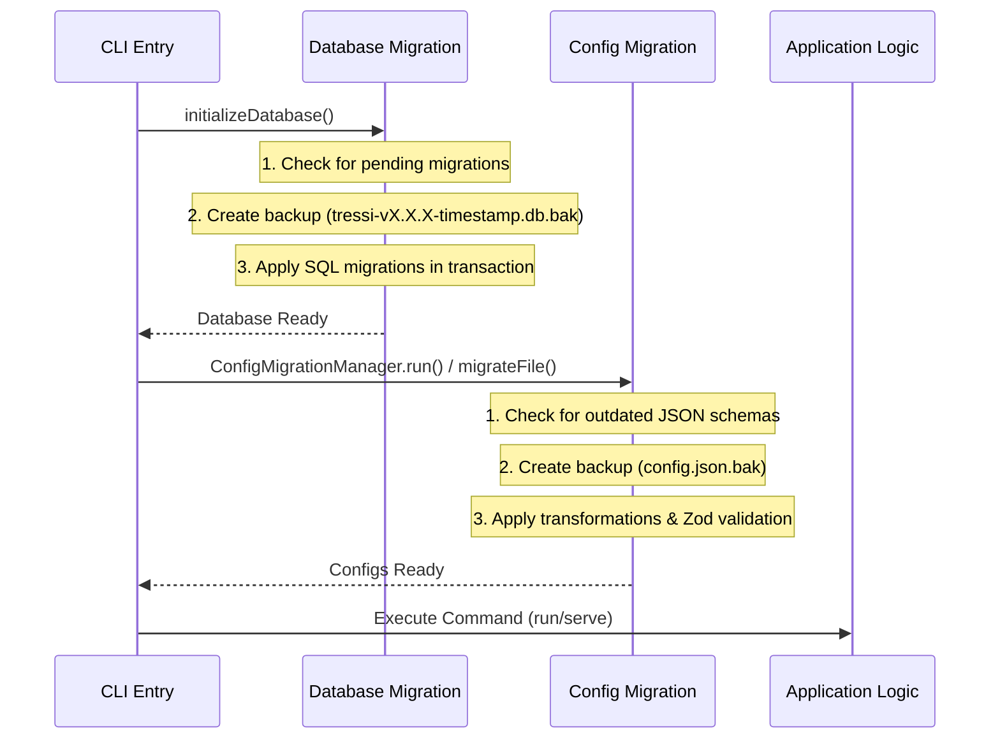
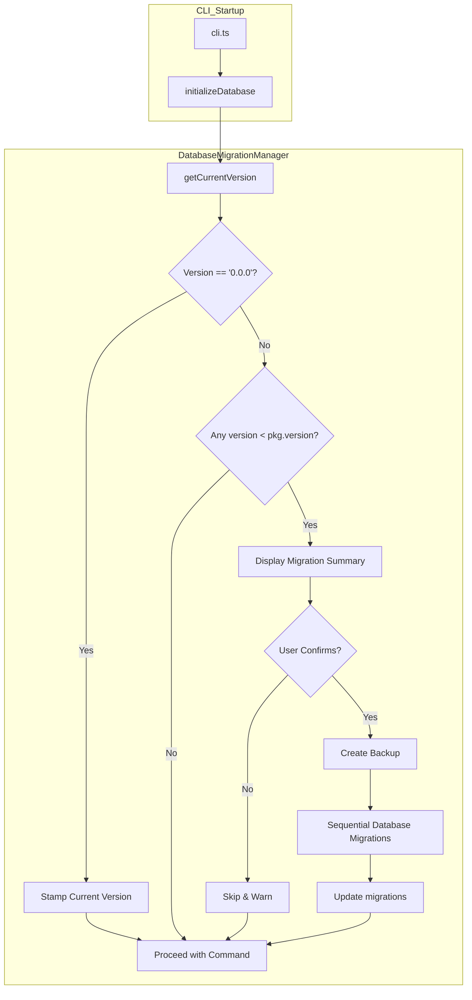
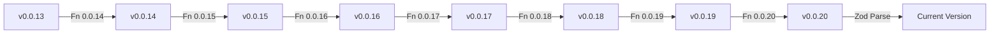

# Migration Architecture

Tressi utilizes sequential migration pipelines to maintain compatibility between evolving configuration schemas and the application runtime. The system leverages registries of transformation functions and Zod validation to ensure that both database stored configurations and local configuration files are upgraded to the latest version before execution.

This document covers both the config migration pipeline (for JSON schema evolution) and the database migration pipeline (for SQLite schema evolution).

### Migration Architecture

The migration system ensures that configurations remain valid as the platform evolves, preventing runtime errors caused by deprecated or renamed fields.



### System Components

**Config Migration:**

- **Config Migration Manager**: Orchestrates the detection and transformation of outdated configurations to ensure compatibility with the current runtime.
- **Transformation Registry**: Maintains a sequential list of version to version functions that programmatically update configuration structures.
- **Zod Validation Layer**: Verifies the final migrated configuration and injects default values to guarantee structural integrity.

**Database Migration:**

- **Database Migration Manager**: Orchestrates the detection and execution of pending migrations during application startup.
- **Migration Registry**: Maintains a sequential list of versioned migration objects containing summaries and `up` functions.
- **Kysely Schema Builder**: Provides a type safe interface for executing DDL (Data Definition Language) commands against the SQLite database.

### Executing the Migration Pipeline

The `ConfigMigrationManager` handles two distinct migration workflows:

1.  **Database Migrations**: Triggered by the `serve` command. It scans the internal SQLite database for all stored configurations.
2.  **File Migrations**: Triggered by the `migrate` command. It validates and updates the specific configuration file provided.

Database migrations always run before configuration migrations when serving the UI. This ensures the underlying storage is ready.

#### Config Migration Workflow Steps:

1.  **Version Detection**: Extracts the version string from the `$schema` field and performs a comparison using `semver`.
2.  **Environment Validation**: Executes migrations only in interactive terminals (TTY). In headless environments, the system logs a warning and continues execution.
3.  **User Confirmation**: Prompts the user to confirm the migration process if outdated configurations are detected.
4.  **Configuration Backup**: Creates a backup (e.g., `tressi.config.json.bak`) for local files before applying transformations.
5.  **Sequential Transformation**: Passes outdated configurations through a series of version to version transformation functions.
6.  **Schema Validation**: Validates the final configuration against the current Zod schema to inject default values and ensure structural integrity.
7.  **Data Persistence**: Persists the updated configuration to the database or the local file system.
8.  **Failure Summarization**: Provides a summary of any encountered failures after processing all configurations.

#### Database Migration Workflow Steps:

1.  **Version Tracking**: The system maintains a `migrations` table to record the highest version successfully applied to the database.
2.  **Fresh Install Detection**: If the `migrations` table is empty (version `0.0.0`), the system assumes a fresh install. It stamps the database with the current application version and skips all intermediate migrations.
3.  **Version Detection**: For existing installations, it compares the current database version against the application version defined in `package.json`.
4.  **User Confirmation**: If pending migrations are found, the system displays a summary of the changes and prompts the user for confirmation.
5.  **Sequential Execution**: Identifies all pending migrations in the registry and applies them in order using semver comparison.
6.  **Transactional Safety**: Each migration is executed within a database transaction. If a migration fails, the transaction is rolled back, and the application halts to prevent data corruption.
7.  **Version Persistence**: Upon successful completion of a migration, the new version is recorded in the `migrations` table.



### Data Integrity & Visibility

Tressi maintains data integrity and provides visibility during the migration process through several safety mechanisms:

- **Automatic Backups**: Revert changes or compare versions using automatic backups (e.g., `tressi.config.json.bak` or `tressi-v0.0.20-1710636892.db.bak`) created before migrating local files or applying schema changes.
- **Change Summaries**: Review planned changes through human readable transformation summaries displayed during the interactive prompt.
- **Visual Diff**: Inspect exact field modifications with terminal based line by line JSON diffs highlighting added, removed, or modified fields.
- **User Control**: Users are prompted before schema changes are applied, allowing for manual backups or inspection if desired.
- **Atomic Updates**: The use of transactions ensures that the database never remains in a partially migrated state.
- **Detailed Logging**: The system logs the summary of each migration as it is applied, providing visibility into schema changes.

### Detecting Configuration Versions

Version detection relies on the `$schema` URL in the configuration JSON. The `ConfigMigrationManager` utilizes a regular expression to extract the version string (e.g., `0.0.19`) from the URL.

A valid Tressi configuration **must** include the `$schema` property. If the property is missing or does not contain a valid Tressi schema URL, the system will report a validation error and halt the migration process for that configuration.

### Registering Schema Transformations

While structural changes such as adding new fields with defaults are handled by Zod validation, semantic changes like renaming a field or changing logic require transformation functions.

These functions are defined in `projects/cli/src/data/migrations.ts` and utilize the `IJsonMigration` interface (defined in `projects/shared/src/cli/migration.types.ts`). Each migration includes a `summary` and an `up` function.

### Maintaining Type Safety

To ensure type safety without maintaining historical schemas, migrations utilize the `VersionedTressiConfig` type (defined in `projects/shared/src/cli/migration.types.ts`) and type guards.

```typescript
export type VersionedTressiConfig = {
  $schema: string;
  [key: string]: unknown;
};
```

When implementing a migration, use a type guard to narrow the `unknown` fields to the expected types for that specific version:

```typescript
'0.0.20': {
  summary: "Convert early exit threshold and monitoring window.",
  up: (config) => {
    const data = config as TressiConfig;
    return {
      ...data,
      $schema: config.$schema.replace(/\d+\.\d+\.\d+/, '0.0.20'),
      options: {
        ...data.options,
        workerEarlyExit: {
          ...data.options?.workerEarlyExit,
          errorRateThreshold: data.options?.workerEarlyExit?.errorRateThreshold
            ? Math.round(data.options.workerEarlyExit.errorRateThreshold * 100) || 1
            : undefined,
          monitoringWindowSeconds: data.options?.workerEarlyExit?.monitoringWindowMs
            ? Math.round(data.options.workerEarlyExit.monitoringWindowMs / 1000)
            : undefined,
        },
      },
    };
  }
}
```

### Applying Sequential Transformations

Migrations are applied sequentially to bridge the gap between the stored configuration version and the current application version.



If a configuration is at version `0.0.13` and the current version is `0.0.20`, the system applies the `0.0.14` through `0.0.20` transformations in order. Each migration key represents the **target version** of that step.

### Defining Database Migrations

Database migrations are defined in `projects/cli/src/data/migrations.ts` and utilize the `IDatabaseMigration` interface (defined in `projects/shared/src/cli/migration.types.ts`). Each migration includes a `summary` and an `up` function.

```typescript
export interface IDatabaseMigration {
  summary: string;
  up: (db: Kysely<Database>) => Promise<void>;
}
```

### Managing Migration Failures

Tressi implements a fault tolerant migration strategy to ensure that individual configuration errors do not halt system execution.

- **Error Isolation**: If a specific configuration fails during transformation or validation, the system catches the error and logs it to the terminal.
- **Continuous Processing**: The `ConfigMigrationManager` continues to process any remaining outdated configurations even if previous attempts encountered errors.
- **Failure Summarization**: After processing all configurations, the system provides a consolidated summary of all failed migrations, including the configuration name and the specific error message.

### v0.0.20 Breaking Changes

The v0.0.20 release introduced several breaking changes to the early exit configuration:

#### `errorRateThreshold` Scale Change

The `errorRateThreshold` field changed from a decimal scale (`0.0` to `1.0`) to a percentage scale (`1` to `100`).

| Before (v0.0.19) | After (v0.0.20) |
| ---------------- | --------------- |
| `0.05` (5%)      | `5`             |
| `0.10` (10%)     | `10`            |
| `0.50` (50%)     | `50`            |

**Special case**: `errorRateThreshold: 0` in v0.0.19 becomes `1` in v0.0.20 (not `0`). This prevents division issues in the threshold calculation.

#### `monitoringWindowMs` Renamed to `monitoringWindowSeconds`

The monitoring window field was renamed and the value is now expressed in seconds instead of milliseconds.

| Before (v0.0.19)           | After (v0.0.20)              |
| -------------------------- | ---------------------------- |
| `monitoringWindowMs: 1000` | `monitoringWindowSeconds: 1` |
| `monitoringWindowMs: 5000` | `monitoringWindowSeconds: 5` |

The converted value has a minimum of `1` second.

#### Auto-Disable Safety Mechanism

If the migrated configuration fails Zod validation after applying the threshold and monitoring window conversions, Tressi automatically disables early exit (`enabled: false`) as a safety fallback rather than failing the migration entirely. This ensures tests can still run even if the configuration had edge cases.

#### Database Schema: `earlyExitTriggered` Field

The v0.0.20 database migration adds the `earlyExitTriggered` boolean field to existing test and metric summaries. This field tracks whether early exit was triggered during test execution.

The field is added to:

- `summary.global.earlyExitTriggered`
- `summary.endpoints[].earlyExitTriggered`

Existing records are backfilled with `false`.

### Data Persistence & Manual Inspection

By default, Tressi stores its internal state in a SQLite database located at `~/.tressi/tressi.db`. This path can be overridden using the `TRESSI_DB_PATH` environment variable.

To manually inspect the migration status, you can query the `migrations` table:

```sql
SELECT * FROM migrations ORDER BY applied_at DESC;
```

### Next Steps

Explore the [Community Guidelines](../06-community/index.md) to learn how to contribute to Tressi.
