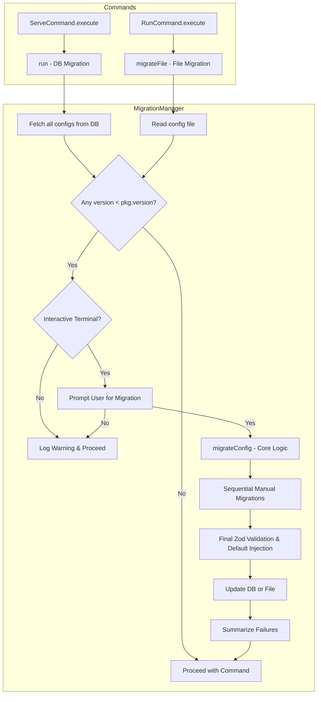
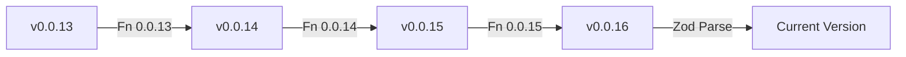

# Schema Migration Architecture

Tressi utilizes a sequential migration pipeline to maintain compatibility between evolving configuration schemas and the application runtime. The system leverages a registry of transformation functions and Zod validation to ensure that both database stored configurations and local configuration files are upgraded to the latest version before execution.

This document covers the migration pipeline, version detection mechanisms, and the implementation of transformation functions for breaking schema changes.

### Migration Pipeline

The migration system ensures that configurations remain valid as the platform evolves, preventing runtime errors caused by deprecated or renamed fields.



### Core Components

- **Migration Manager**: Orchestrates the detection and transformation of outdated configurations to ensure compatibility with the current runtime.
- **Transformation Registry**: Maintains a sequential list of version to version functions that programmatically update configuration structures.
- **Zod Validation Layer**: Verifies the final migrated configuration and injects default values to guarantee structural integrity.

### Executing Migrations

The `MigrationManager` handles two distinct migration workflows:

1.  **Database Migrations**: Triggered by the `serve` command. It scans the internal SQLite database for all stored configurations.
2.  **File Migrations**: Triggered by the `run` command. It validates the specific configuration file provided for the test execution (e.g., `tressi.config.json`).

#### Workflow Steps:

1.  **Version Detection**: Extracts the version string from the `$schema` field and performs a comparison using `semver`.
2.  **Environment Validation**: Executes migrations only in interactive terminals (TTY). In headless environments, the system logs a warning and continues execution.
3.  **User Confirmation**: Prompts the user to confirm the migration process if outdated configurations are detected.
4.  **Configuration Backup**: Creates a backup (e.g., `tressi.config.json.bak`) for local files before applying transformations.
5.  **Sequential Transformation**: Passes outdated configurations through a series of version to version transformation functions.
6.  **Schema Validation**: Validates the final configuration against the current Zod schema to inject default values and ensure structural integrity.
7.  **Data Persistence**: Persists the updated configuration to the database or the local file system.
8.  **Failure Summarization**: Provides a summary of any encountered failures after processing all configurations.

### Transparency & Safety

Tressi prioritizes data integrity and user awareness during the migration process through several safety mechanisms:

- **Automatic Backups**: Before migrating a local configuration file, Tressi creates a backup (e.g., `tressi.config.json.bak`). This allows users to manually compare changes or revert if necessary.
- **Change Summaries**: During the interactive prompt, Tressi displays a human-readable summary of every transformation step that will be applied to the configuration.
- **Visual Diff**: The terminal displays a line-by-line JSON diff highlighting exactly which fields will be added, removed, or modified.
- **Automated Migrations**: For CI/CD or headless environments, the `--migrate` (or `-m`) flag can be used to automatically accept and apply migrations without an interactive prompt.

### Detecting Schema Versions

Version detection relies on the `$schema` URL in the configuration JSON. The `MigrationManager` utilizes a regular expression to extract the version string (e.g., `0.0.13`) from the URL.

A valid Tressi configuration **must** include the `$schema` property. If the property is missing or does not contain a valid Tressi schema URL, the system will report a validation error and halt the migration process for that configuration.

### Registering Transformations

While structural changes such as adding new fields with defaults are handled by Zod validation, semantic changes like renaming a field or changing logic require transformation functions.

These functions are defined in [`projects/cli/src/migrations/registry.ts`](projects/cli/src/migrations/registry.ts) and utilize the `Migration` interface. Each migration includes a `summary` and a `transform` function.

### Ensuring Type Safety

To ensure type safety without maintaining historical schemas, migrations utilize the `VersionedConfig` interface and type guards.

```typescript
export interface VersionedConfig {
  $schema: string;
  [key: string]: unknown;
}
```

When implementing a migration, use a type guard to narrow the `unknown` fields to the expected types for that specific version:

```typescript
// Example: Renaming a field
'0.0.13': {
  summary: "Rename 'oldField' to 'newField' for better clarity.",
  transform: (config) => {
    if (!('oldField' in config) || typeof config.oldField !== 'string') {
      throw new Error('Migration 0.0.13 failed: "oldField" is missing or not a string');
    }
    const { oldField, ...rest } = config;
    return {
      ...rest,
      $schema: config.$schema.replace('0.0.13', '0.0.14'),
      newField: oldField,
    };
  }
}
```

### Applying Sequential Updates

Migrations are applied sequentially to bridge the gap between the stored configuration version and the current application version.



If a configuration is at version `0.0.13` and the current version is `0.0.16`, the system applies the `0.0.13 -> 0.0.14`, `0.0.14 -> 0.0.15`, and `0.0.15 -> 0.0.16` transformations in order.

### Injecting Schema Defaults

The final step in the migration pipeline is a call to `TressiConfigSchema.parse()`. This process achieves three objectives:

1.  **Structural Integrity**: Ensures the migrated configuration adheres to the current schema.
2.  **Default Injection**: Injects new fields defined with a `.default()` value in the Zod schema.
3.  **Version Synchronization**: Updates the `$schema` URL to point to the latest version.

### Handling Migration Failures

Tressi implements a fault tolerant migration strategy to ensure that individual configuration errors do not halt system execution.

- **Error Isolation**: If a specific configuration fails during transformation or validation, the system catches the error and logs it to the terminal.
- **Continuous Processing**: The `MigrationManager` continues to process any remaining outdated configurations even if previous attempts encountered errors.
- **Failure Summarization**: After processing all configurations, the system provides a consolidated summary of all failed migrations, including the configuration name and the specific error message.
- **Execution Continuity**: The application proceeds with the original command (e.g., `serve` or `run`). Configurations that failed to migrate remain in their original state and may require manual intervention if they are incompatible with the current runtime.

### Implementing New Migrations

When releasing a new version of Tressi with breaking schema changes:

1.  Identify the required semantic changes.
2.  Add a new entry to the `MIGRATIONS` registry in [`projects/cli/src/migrations/registry.ts`](projects/cli/src/migrations/registry.ts).
3.  Provide a clear `summary` of the changes.
4.  Return the transformed configuration object from the `transform` function.

### Next Steps

Return to the [Internals Overview](./index.md) or explore the [Community Guidelines](../06-community/index.md) to learn how to contribute to Tressi.
