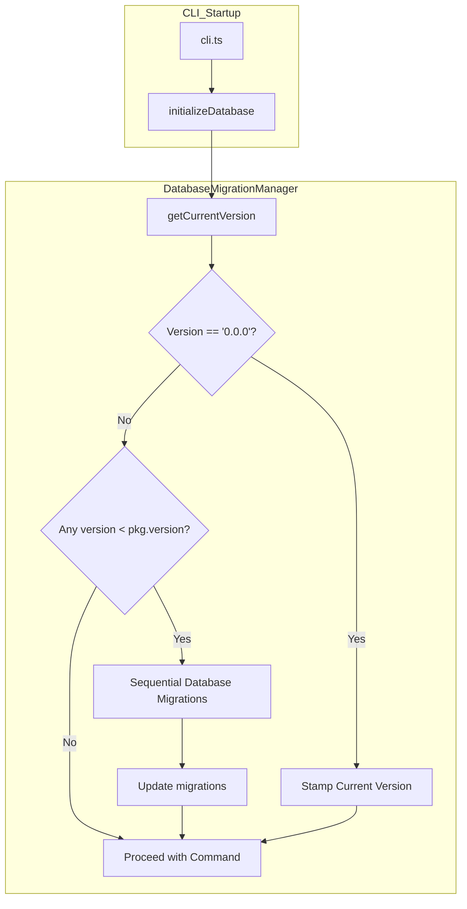

# Database Migration Architecture

Tressi utilizes a sequential database migration pipeline to maintain the integrity of the internal SQLite schema as the application evolves. The system leverages Kysely's schema builder and a versioned registry of migration functions to ensure that the database structure is always compatible with the current application runtime.

This document covers the database migration pipeline, version tracking mechanisms, and the implementation of schema transformations.

### Pipeline Execution

The database migration system ensures that the SQLite schema remains synchronized with the application version, preventing runtime errors caused by missing tables, columns, or indexes.



### System Components

- **Database Migration Manager**: Orchestrates the detection and execution of pending migrations during application startup.
- **Migration Registry**: Maintains a sequential list of versioned migration objects containing summaries and `up` functions.
- **Kysely Schema Builder**: Provides a type safe interface for executing DDL (Data Definition Language) commands against the SQLite database.

### Migration Workflow

Database migrations are triggered automatically during the CLI initialization process, before any commands (such as `serve` or `run`) are executed.

#### Workflow Steps:

1.  **Version Tracking**: The system maintains a `migrations` table to record the highest version successfully applied to the database.
2.  **Fresh Install Detection**: If the `migrations` table is empty (version `0.0.0`), the system assumes a fresh install. It stamps the database with the current application version and skips all intermediate migrations.
3.  **Version Detection**: For existing installations, it compares the current database version against the application version defined in `package.json`.
4.  **Sequential Execution**: Identifies all pending migrations in the registry and applies them in order using semver comparison.
5.  **Transactional Safety**: Each migration is executed within a database transaction. If a migration fails, the transaction is rolled back, and the application halts to prevent data corruption.
6.  **Version Persistence**: Upon successful completion of a migration, the new version is recorded in the `migrations` table.

### Integrity & Safety

Tressi prioritizes database integrity through several safety mechanisms:

- **Automatic Execution**: Migrations run automatically during startup, ensuring the environment is always ready for execution without manual intervention.
- **Atomic Updates**: The use of transactions ensures that the database never remains in a partially migrated state.
- **Detailed Logging**: The system logs the summary of each migration as it is applied, providing visibility into schema changes.

### Defining Migrations

Database migrations are defined in `projects/cli/src/data/database-migrations.ts` and utilize the `IDatabaseMigration` interface (defined in `projects/shared/src/cli/migration.types.ts`). Each migration includes a `summary` and an `up` function.

```typescript
export interface IDatabaseMigration {
  summary: string;
  up: (db: Kysely<Database>) => Promise<void>;
}
```

### Adding New Migrations

When releasing a new version of Tressi with database schema changes:

1.  Identify the required DDL changes (e.g., adding a column, creating an index).
2.  Update the base schema in `projects/cli/src/data/database.ts` to include the new changes. This ensures fresh installs receive the correct schema immediately.
3.  Add a new entry to the `DATABASE_MIGRATIONS` registry in `projects/cli/src/data/database-migrations.ts`.
4.  Provide a clear `summary` of the changes.
5.  Implement the `up` function using the Kysely `db.schema` builder.

```typescript
// Example: Adding a column
'0.0.14': {
  summary: "Add 'description' column to 'configs' table.",
  up: async (db) => {
    await db.schema
      .alterTable('configs')
      .addColumn('description', 'text')
      .execute();
  }
}
```

### Data Persistence & Manual Inspection

By default, Tressi stores its internal state in a SQLite database located at `~/.tressi/tressi.db`. This path can be overridden using the `TRESSI_DB_PATH` environment variable.

To manually inspect the migration status, you can query the `migrations` table:

```sql
SELECT * FROM migrations ORDER BY applied_at DESC;
```

### Next Steps

Explore the [Community Guidelines](../06-community/index.md) to learn how to contribute to Tressi.
