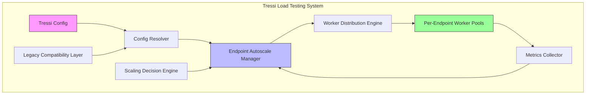
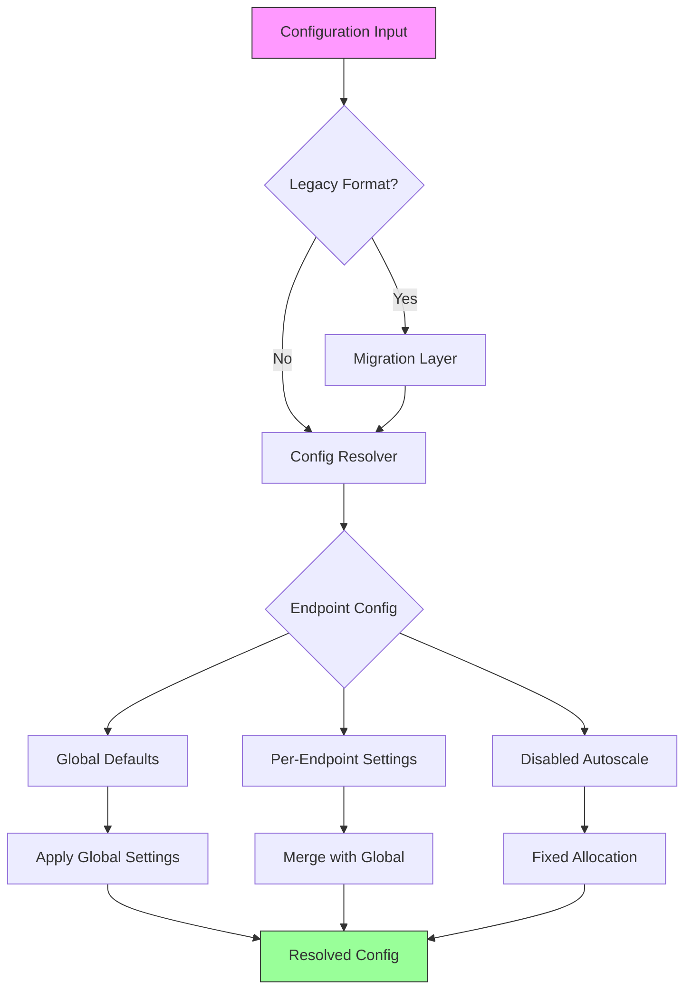
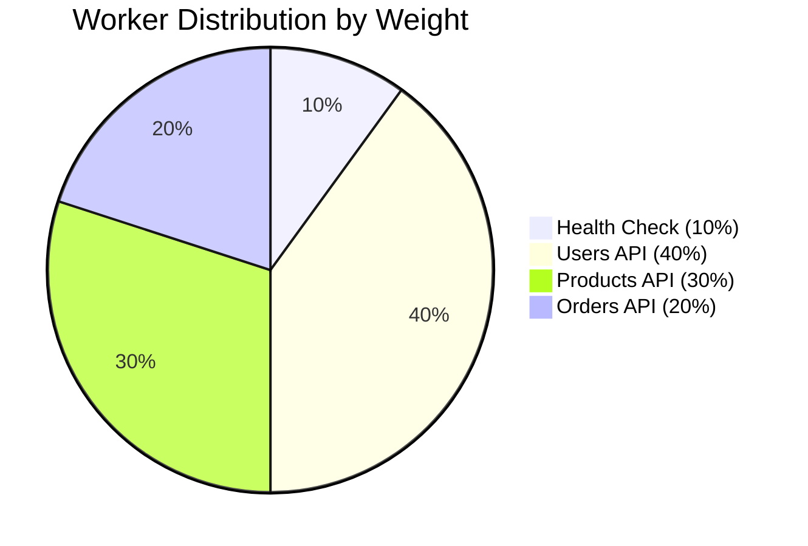
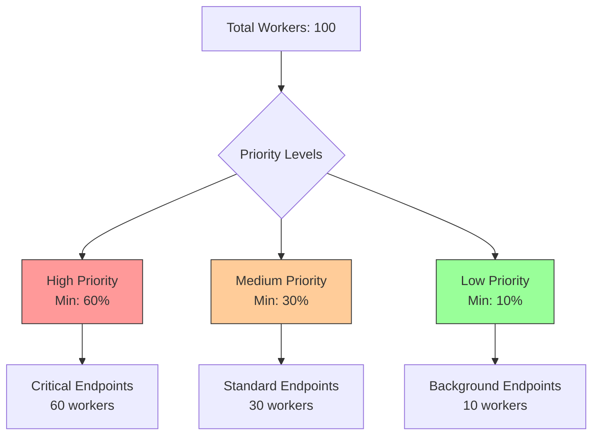
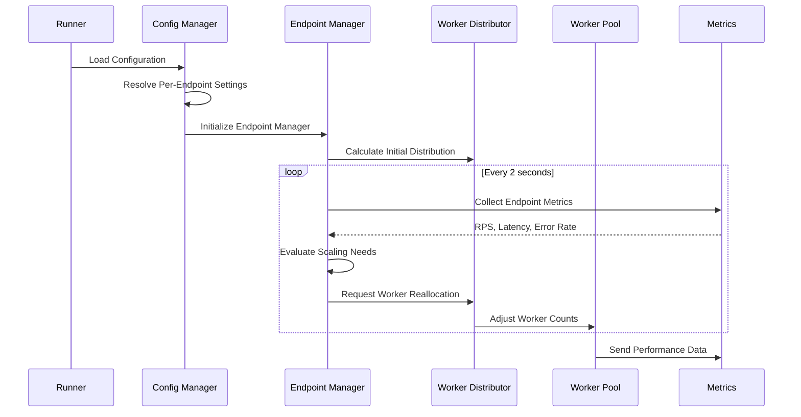
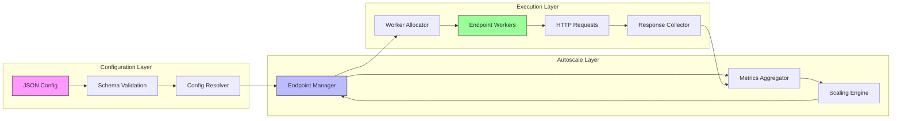
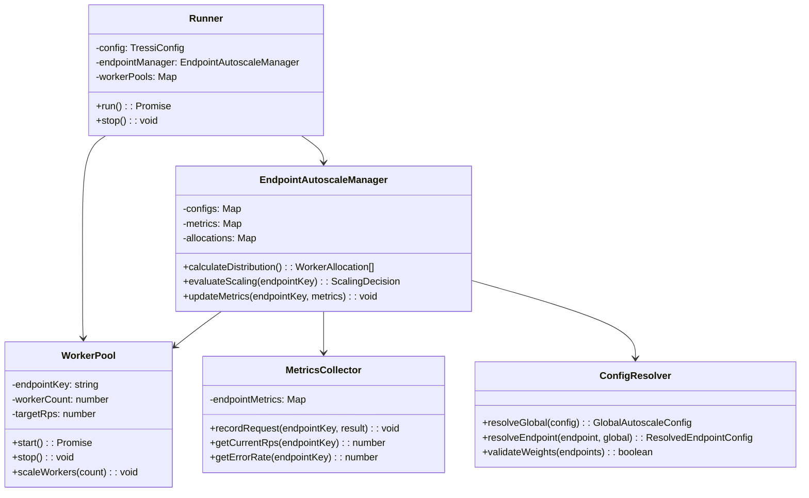
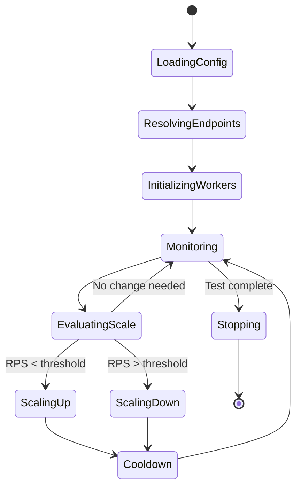
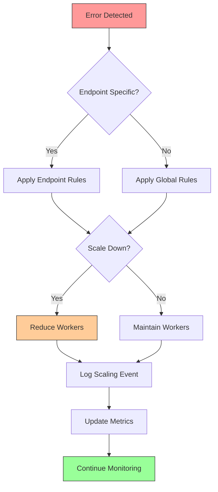

# Per-Endpoint Autoscale Architecture Diagrams

## System Architecture Overview

## Configuration Flow

## Worker Distribution Strategies

### Proportional Distribution

### Priority-Based Distribution

## Runtime Flow

## Data Flow Architecture

## Class Architecture

## State Management

## Error Handling Flow

